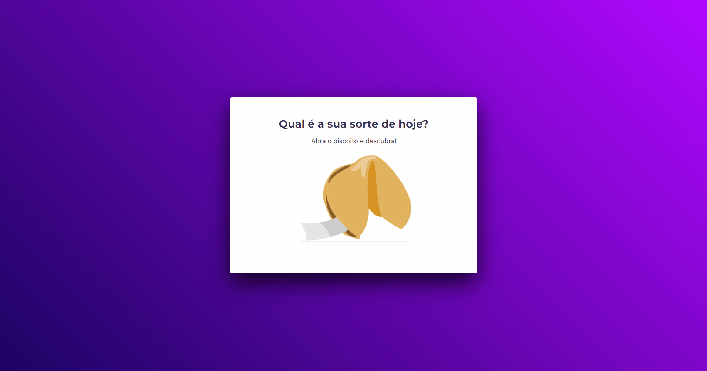

<h1 align="center"> Desafio JS - Biscoito da Sorte </h1>

 

  

## Sobre o desafio

Este foi o primeiro desafio com JavaScript do curso da rocketseat.   
O objetivo era criar um jogo onde você clica no biscoito e ele mostra uma mensagem.  

## Tecnologias utilizadas

Esse projeto foi desenvolvido com as seguintes tecnologias:

- HTML
- CSS
- JavaScript
- Github
- Figma